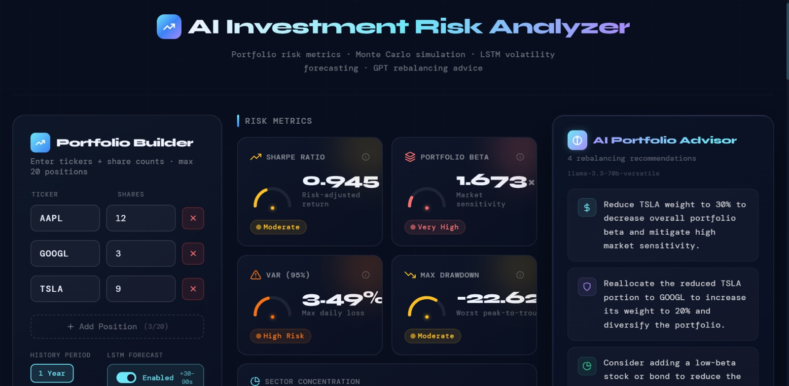
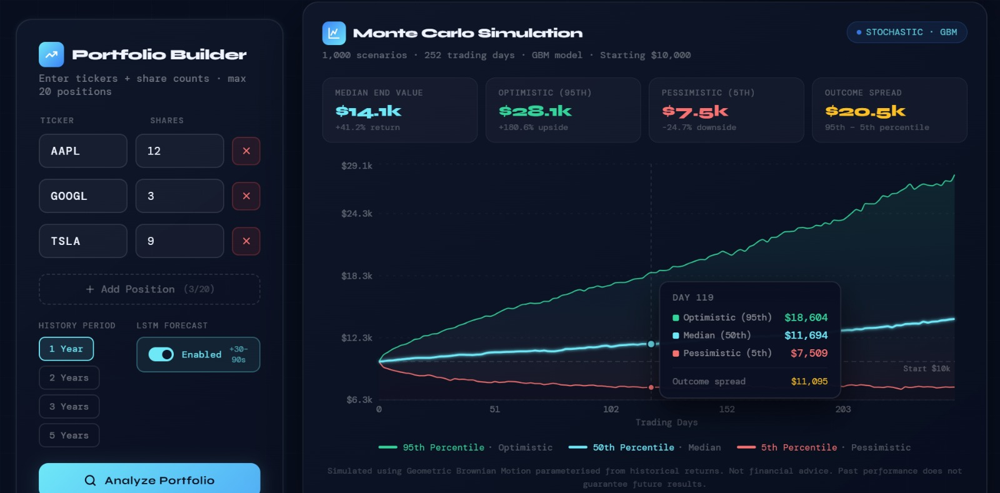
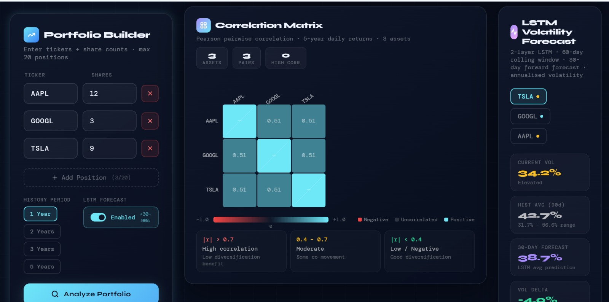
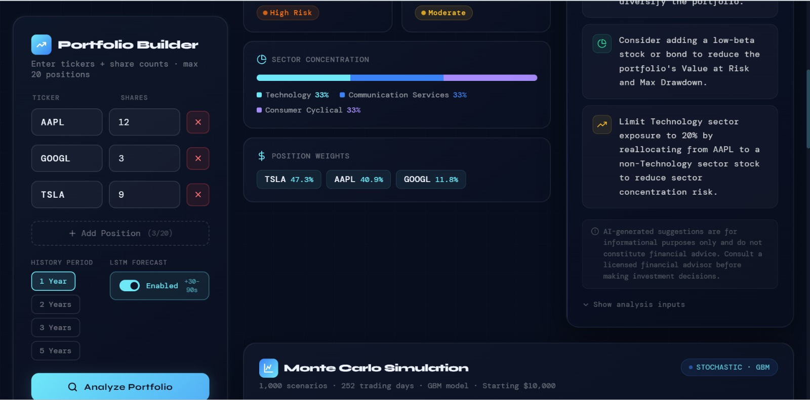
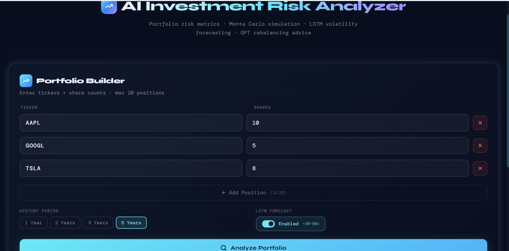

# 📈 AI Investment Risk Analyzer

> A full-stack ML web application that analyzes stock portfolio risk using real-time data, Monte Carlo simulation, LSTM volatility forecasting, and AI-powered rebalancing advice.

    

---

## 📸 Screenshots

### Full Dashboard


### Monte Carlo Simulation


### Correlation Matrix & LSTM Volatility Forecast


### Sector Concentration & AI Portfolio Advisor


### Portfolio Builder


---

## 🚀 What It Does

Enter any stock tickers (e.g. AAPL, GOOGL, TSLA) and the app will:

- 📊 Download **5 years of real stock data** from Yahoo Finance
- ⚡ Compute **professional risk metrics** (Sharpe Ratio, Beta, VaR, Max Drawdown)
- 🎲 Run **1000 Monte Carlo simulations** to forecast future portfolio value
- 🤖 Train an **LSTM neural network** to forecast stock volatility
- 🧩 Generate **AI-powered rebalancing advice** using LLaMA 3.3 via Groq
- 📉 Display everything in a **beautiful interactive dark-theme dashboard**

---

## 🛠️ Tech Stack

| Layer | Technology |
|-------|-----------|
| Backend API | Python 3.13 + FastAPI |
| ML Models | TensorFlow/Keras (LSTM) + scikit-learn |
| Risk Engine | NumPy + Pandas |
| AI Advisor | LangChain + Groq (LLaMA 3.3-70b) |
| Data Source | yfinance (Yahoo Finance) |
| Frontend | React 18 + Recharts |
| Styling | Custom CSS (dark theme) |

---

## 📁 Project Structure

```
portfolio-analyzer/
├── backend/
│   ├── main.py              # FastAPI server & endpoints
│   ├── risk_engine.py       # Sharpe, Beta, VaR, Monte Carlo, Correlation
│   ├── lstm_model.py        # 2-layer LSTM volatility forecaster
│   ├── ai_advisor.py        # LangChain + Groq AI advisor
│   └── requirements.txt     # Python dependencies
├── frontend/
│   └── src/
│       ├── App.jsx
│       └── components/
│           ├── PortfolioInput.jsx
│           ├── RiskScoreCard.jsx
│           ├── MonteCarloChart.jsx
│           ├── HeatmapChart.jsx
│           ├── VolatilityChart.jsx
│           └── AIAdvisorPanel.jsx
├── screenshots/             # App screenshots
└── README.md
```

---

## ⚙️ Setup & Installation

### Prerequisites
- Python 3.10+
- Node.js 18+
- Groq API key (free at [console.groq.com](https://console.groq.com))

### Backend Setup
```bash
cd backend
python -m venv venv
venv\Scripts\activate        # Windows
pip install -r requirements.txt
```

### Environment Variables
Create a `.env` file in the `backend/` folder:
```
GROQ_API_KEY=your-groq-key-here
```

### Run the App
```bash
# Terminal 1 — Backend
cd backend
venv\Scripts\activate
uvicorn main:app --reload --port 8000

# Terminal 2 — Frontend
cd frontend
npm install
npm start
```

Open [http://localhost:3000](http://localhost:3000) in your browser.

---

## 🔬 Key Features Explained

### LSTM Volatility Forecasting
A 2-layer LSTM neural network trained on 5 years of rolling volatility data predicts future volatility for each stock. Architecture: `Input(60 days) → LSTM(50) → Dropout(0.2) → LSTM(50) → Dropout(0.2) → Dense(1)`

### Monte Carlo Simulation
Runs 1000 stochastic simulations using Geometric Brownian Motion (GBM) to model the range of possible future portfolio values over 252 trading days.

### Risk Metrics
- **Sharpe Ratio**: `(Return - Risk Free Rate) / Std Dev`
- **Beta**: Portfolio covariance with SPY / SPY variance
- **VaR (95%)**: 5th percentile of historical daily returns
- **Max Drawdown**: Maximum peak-to-trough decline

### AI Advisor
Uses LangChain to format risk metrics into a structured prompt and sends it to LLaMA 3.3-70b via Groq API, returning 3-4 specific actionable rebalancing recommendations.

---

## 📊 Sample Output

For a portfolio of AAPL (12 shares), GOOGL (3 shares), TSLA (9 shares):

```
Sharpe Ratio:    0.945  (Moderate)
Portfolio Beta:  1.673  (Very High)
VaR (95%):       3.49%  (High Risk)
Max Drawdown:   -22.62% (Moderate)
```

AI Advice:
> • Reduce TSLA weight to 30% to decrease overall portfolio beta
> • Reallocate the reduced TSLA portion to GOOGL to increase diversification
> • Consider adding a low-beta stock or bond to reduce Value at Risk
> • Limit Technology sector exposure to 20% to reduce concentration risk

---

## 📄 License

MIT License — free to use for personal and educational purposes.

---

## 👩‍💻 Author

**Prerna Pandit**
- GitHub: [@prernapandit1](https://github.com/prernapandit1)

---

*Built as part of Microsoft SWE Internship Portfolio Projects 2026*
